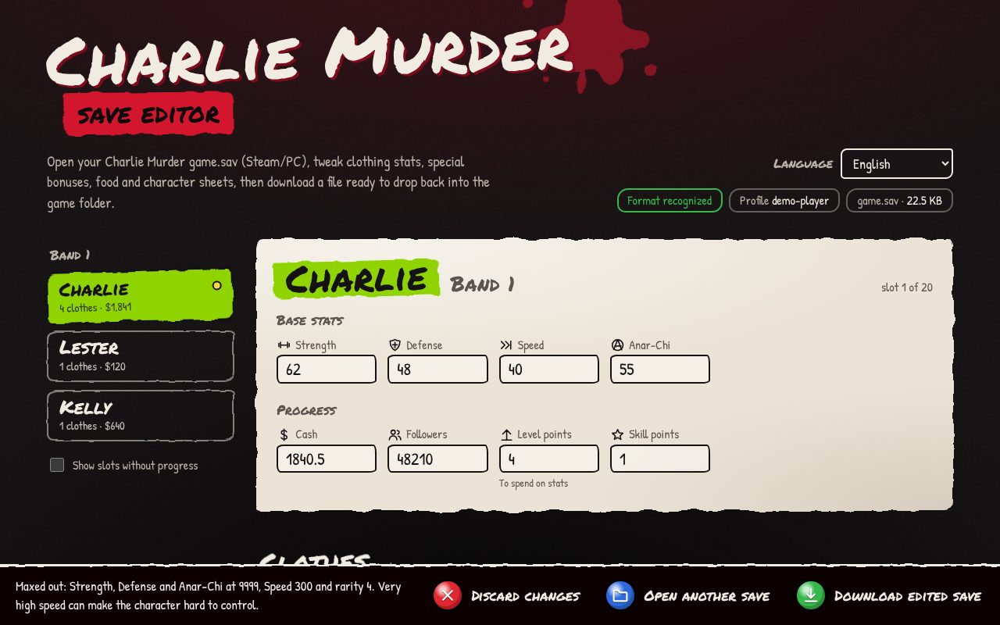
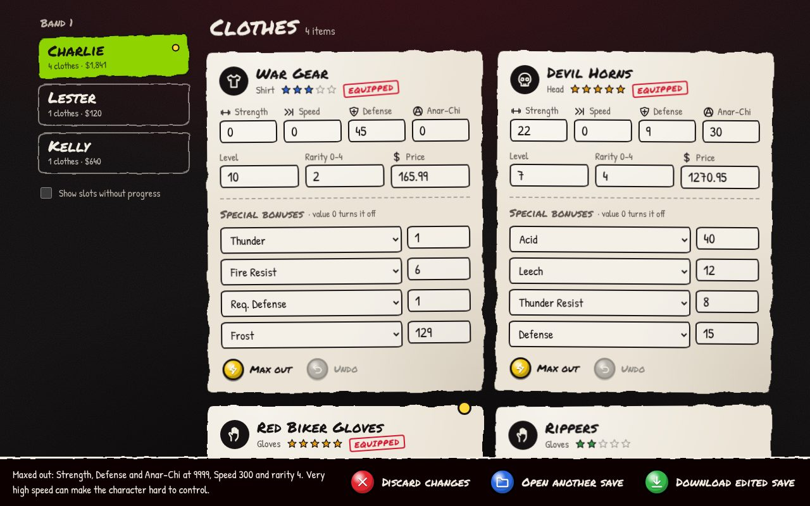
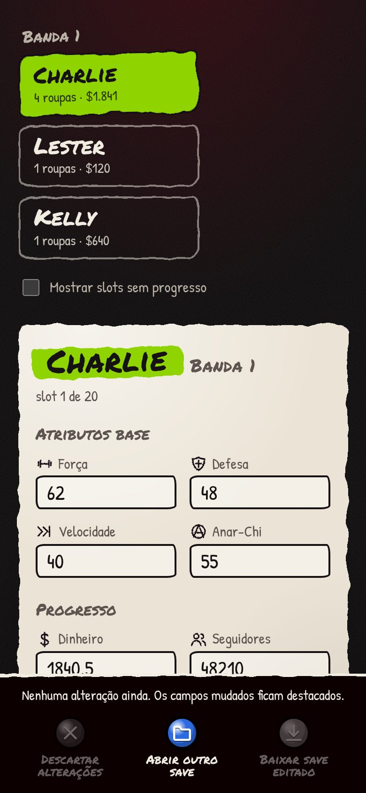
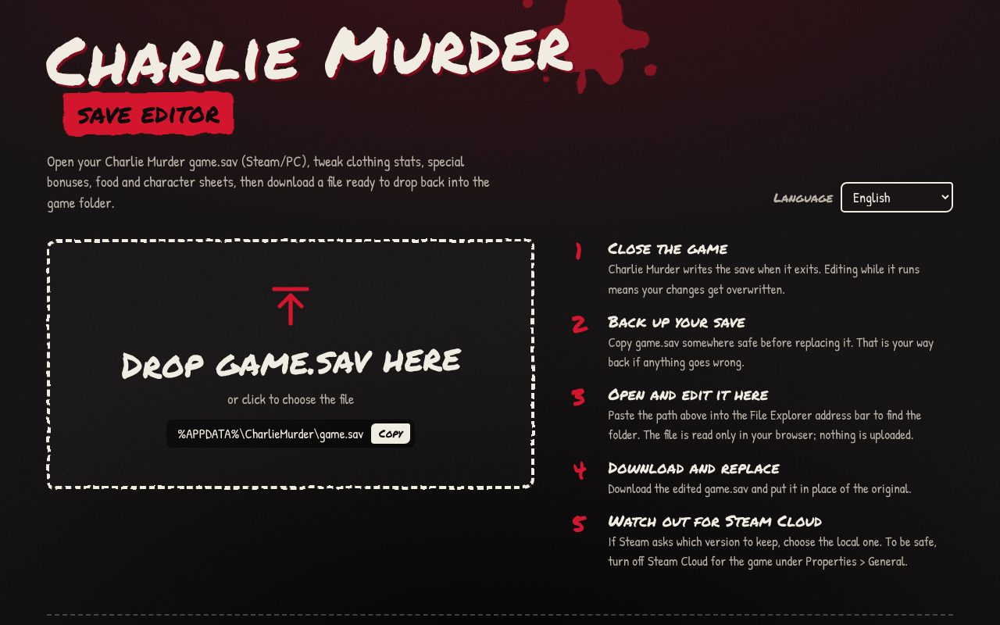
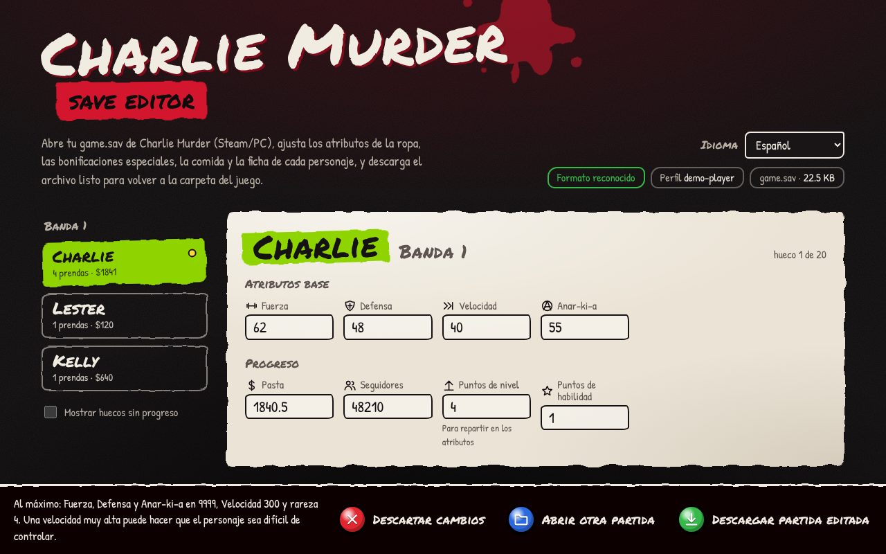

# Charlie Murder Save Editor

A visual, browser-based save editor for **Charlie Murder** (Steam/PC). Open
your `game.sav`, change clothing stats and special bonuses, food, and each
character's sheet, then download the edited file. No install and no upload:
the file never leaves your browser.

Available in **English**, **Español** and **Português (BR)**.

**[Open the editor →](https://barbxsa.com.br/charlie-murder-save-editor/)**

[](https://github.com/barbxsa/charlie-murder-save-editor/actions/workflows/ci.yml)
[](LICENSE)

> [Leia em português](#português)



| Clothing stats and special bonuses | On a phone (PT-BR) |
| --- | --- |
|  |  |

<details>
<summary>More screenshots</summary>




</details>

## Features

- Edit **clothing**: Strength, Speed, Defense, Anar-Chi, level, rarity, price
  and all four special bonuses (Fire, Leech, Crit, Stun, Rapid Jabs! and 33 more).
- Edit **food**: quantity and the stats it grants.
- Edit the **character sheet**: base stats, cash, followers, level and skill points.
- One-click **Max out** for a clothing piece, plus per-item undo.
- Works on all 20 roster slots (4 bands × Charlie, Lester, Tommy, Rex, Kelly).
- Safe by design: only the numbers you change are rewritten in place, and the
  output is re-read before download. Untouched saves come out byte-for-byte identical.
- Language picker (EN default, ES, PT-BR). Bonus names come from the game's
  own translations.
- Styled after the game's hand-drawn menus: marker lettering, painted panels
  and controller-style buttons. All art is original to this project; fonts
  (Permanent Marker, Patrick Hand, both SIL OFL) are bundled, so the page makes
  no third-party requests.

## Using it

1. Close the game.
2. Open **https://barbxsa.com.br/charlie-murder-save-editor/**.
3. Back up `%APPDATA%\CharlieMurder\game.sav`.
4. Drop in `game.sav` and make your changes.
5. Download and replace the original file.
6. If Steam Cloud offers a conflict, keep the **local** file (or disable Steam
   Cloud for the game under *Properties › General*).

## Development

Requires Node.js 20+.

```bash
npm install
npm run dev        # http://localhost:5173
npm test           # unit tests (synthetic saves)
npm run build      # static site in dist/
```

Test against your own save without committing it:

```bash
# PowerShell
$env:CM_SAVE="$env:APPDATA\CharlieMurder\game.sav"; npm test
```

You can force a language with `?lang=en`, `?lang=es` or `?lang=pt-BR`.

No save of your own? `docs/demo/game.sav` is a fictional save you can open in
the editor (rebuild it with `npm run demo-save`).

### Project layout

```
src/
  save/format.ts   game.sav reader/writer (no DOM, fully tested)
  i18n/            en.ts (source of keys), es.ts, pt-BR.ts, index.ts
  ui/icons.ts      hand-drawn style SVG icons
  main.ts          UI
  style.css        theme (painted edges come from SVG filters in index.html)
tests/             Vitest tests + a writer that builds synthetic saves
scripts/           demo save generator
docs/save-format.md  binary layout of game.sav
docs/screenshots/  images used in this README
```

### Adding a language

1. Copy `src/i18n/en.ts` to `src/i18n/<code>.ts` and type it as `Messages`
   (TypeScript will flag any missing key).
2. Register it in `LOCALES` and `MESSAGES` in `src/i18n/index.ts`.

### Deploying

`npm run build` produces a fully static site in `dist/` with relative paths,
so it works from any sub-folder. The live version is the contents of `dist/`
uploaded to `barbxsa.com.br/charlie-murder-save-editor/`.

GitHub Actions (`.github/workflows/ci.yml`) runs the tests and the build on
every push and pull request, and keeps the built site as a downloadable
artifact.

## Disclaimer

Fan-made tool, not affiliated with or endorsed by Ska Studios or Microsoft.
It contains no game assets. Always keep a backup of your save.

## Author

Made by [@barbxsa](https://github.com/barbxsa). Issues and pull requests are
welcome on [GitHub](https://github.com/barbxsa/charlie-murder-save-editor/issues).

## License

[MIT](LICENSE)

---

## Português

Editor visual de saves do **Charlie Murder** (Steam/PC), direto no navegador:
**[barbxsa.com.br/charlie-murder-save-editor](https://barbxsa.com.br/charlie-murder-save-editor/)**.
Abra o `game.sav`, altere atributos e bônus especiais das roupas, comidas e a
ficha de cada personagem, e baixe o arquivo editado. Nada é enviado para
servidor nenhum.

**Como usar:** feche o jogo, faça backup de
`%APPDATA%\CharlieMurder\game.sav`, abra o editor, edite, baixe e substitua o
original. Se a Steam Cloud acusar conflito, mantenha a versão **local**.

**Desenvolvimento:** `npm install`, `npm run dev`, `npm test`, `npm run build`.
Para publicar, envie o conteúdo de `dist/` para a pasta do site.
O formato do arquivo está documentado em [docs/save-format.md](docs/save-format.md).

Feito por [@barbxsa](https://github.com/barbxsa).
